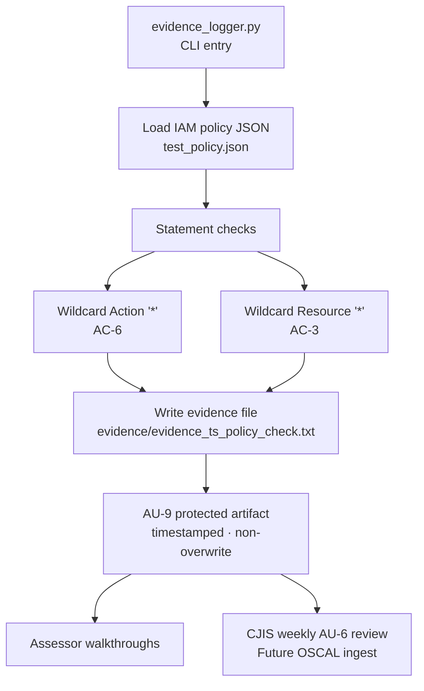

# Evidence Logger

I needed a tiny, stdlib-only script that reads an IAM policy JSON, flags wildcard
`Action: "*"` and `Resource: "*"`, and writes a timestamped text file under
`evidence/` so a later run cannot clobber an earlier one. The repo ships
`test_policy.json` with a `DangerousAdmin` statement that fails both checks.

No boto3. No network call. The filename pattern is
`evidence/evidence_<timestamp>_policy_check.txt`. Policy path is a hard-coded
`policy_file` variable today; CLI args are still future work.

## Compliance Controls Addressed

| NIST 800-53 Rev 5 | FedRAMP High | CJIS v6.1 | Validation Method |
|--------------------|:------------:|:---------:|-------------------|
| AU-2 Event Logging | Yes | - | Every check generates a structured audit record |
| AU-3 Content of Audit Records | Yes | - | Records include timestamp, target file, finding, severity |
| AU-9 Protection of Audit Information | Yes | - | Timestamped filenames prevent overwrite; dedicated `evidence/` directory |
| AU-12 Audit Record Generation | Yes | - | Records generated automatically on every invocation |
| AC-3 Access Enforcement | Yes | - | Flags wildcard `Resource: "*"` policy statements |
| AC-6 Least Privilege | Yes | - | Flags wildcard `Action: "*"` policy statements |
| AU-6 Audit Record Review | Yes | 1-year retention, weekly review | Evidence files feed the CJIS audit-review workflow |

## Purpose

During GRC audits, you need to prove:

- When a check was performed
- What was checked
- What issues were found

This script writes that proof to disk on every run. `test_policy.json` is there so
you can exercise it without exporting a live IAM policy first.

## Features

- Timestamped filenames so prior evidence is never overwritten (AU-9)
- Dedicated `evidence/` directory kept apart from the script and fixtures (AU-9)
- Each record carries timestamp, target file, finding text, and FAIL markers (AU-3)
- Wildcard `Action: "*"` (AC-6) and wildcard `Resource: "*"` (AC-3) checks
- Plain text an assessor can open during a walkthrough without a custom viewer

## Architecture Overview



Editable Mermaid source (kept in sync with the fence above): [`docs/architecture.mmd`](docs/architecture.mmd).

`evidence_logger.py` loads the policy, walks each Statement, and writes FAILs into
a new file under `evidence/`. Same files can sit in a weekly AU-6 review packet.
OSCAL ingest is tracked as a future item (issue #6).

## Requirements

- Python 3.6 or higher
- No external dependencies (uses standard library only)

## Usage

1. Place the IAM policy JSON file in the same directory as the script.
2. Update the `policy_file` variable if your file has a different name.
3. Run the script:

```bash
python evidence_logger.py
```

4. Check the generated evidence file inside the `evidence/` directory:

```
evidence/evidence_2025-12-09_17-27-15_policy_check.txt
```

## Example Output

```
================================================================================
COMPLIANCE EVIDENCE LOG
================================================================================
Timestamp: 2025-12-09_17-27-15

Checking: test_policy.json

[FAIL] Statement "DangerousAdmin": Action is "*"
[FAIL] Statement "DangerousAdmin": Resource is "*"

Result: 2 issues found

================================================================================
END OF LOG
================================================================================
```

## How an Auditor Uses This Output

Hand the assessor the `evidence/` directory, or one file from it. The timestamp in
the name answers "when," the `Checking:` line answers "what," and each `[FAIL]`
line is the finding. For AU-3 that is enough content for a walkthrough: time,
target, outcome. AU-9 is the non-overwrite part. This does not talk to IAM APIs;
you still have to export or copy the policy JSON into place first.

## FedRAMP 20x Alignment

The artifact is structured text, not OSCAL. That is intentional for v1: small,
readable, no dependencies. When I need machine ingest I will add JSON / OSCAL
Assessment Results output so continuous-monitoring tooling can read the same run
without a human transcription step. Until then, the value is a repeatable file
per run with a stable naming scheme.

## CJIS v6.1 Relevance

CJIS v6.1 (Dec 27, 2024; default audit baseline April 1, 2026; Priority 2-4 fully
enforceable Oct 1, 2027) wants AU-6 weekly review and 1-year retention for
CJI-related audit records. These files are a review input. Timestamped names do
not equal WORM retention; a later step is S3 archival with Object Lock so the
year is enforced at storage, not by hoping nobody deletes the folder.

## Roadmap

This is the packaging layer I want the other audit scripts to write into inside
the Unified Evidence Collector (Project 4). OSCAL Assessment Results emission,
S3 Object Lock archival for the CJIS AU-6 year, and a direct handoff into
[`oscal-evidence-pipeline`](https://github.com/0xBahalaNa/oscal-evidence-pipeline)
are the three pieces that close that loop.

## Future Improvements

- Accept policy filename as a command-line argument
- Scan multiple policies in a directory
- Add more compliance checks (e.g., `Effect: Allow` without `Condition`, principal wildcards)
- Output JSON / OSCAL Assessment Results format for FedRAMP 20x pipelines
- S3 archival of evidence files with Object Lock (CJIS AU-6 1-year retention)

## Framework Reference

Control family mappings and AWS implementation details are documented in [nist-800-53-rev-5-to-aws-mapping](https://github.com/0xBahalaNa/nist-800-53-rev-5-to-aws-mapping).

## License

MIT License
